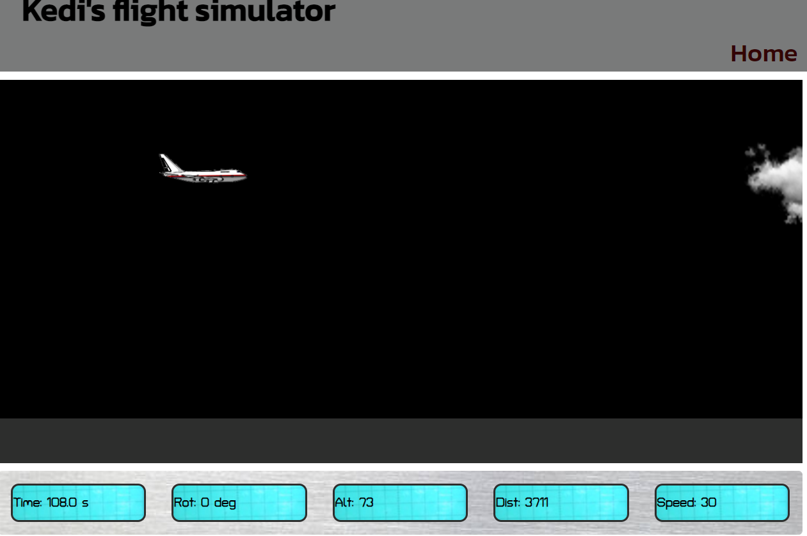

**<h1>Kedi's flight Sim</h1>**

Kedi's flight simulator is a simple online game that runs on any browser. It is intended to run on offline mode as a pass-time and replace the "Not connected to internet" error in browsers.

Visit our [website](https://kedi1991.github.io/project-flight-sim/) and play!!!!
<h2>1. Purpose of the project</h2>

Kedi's flight simulator is a simple online game that runs on any browser. It is intended to run on offline mode as a pass-time and replace the Not connected to internet error in browsers.

<h2>2. User stories</h2>

- The game was created to be small in size and interesting
- Should be available in all browsers and platforms
- Should have a simple user guide 
- Should be able to give feed back to the user on their progress as they play.
- A user is able to stop the plane after landing
- A user can adjust plane angle to cause lift and drag
- The user should be abl to access all features of the game on desktop, tablet and mobile devices.

<h2>3. Features</h2>

- Big black Display screen
- keyboard controls for desktop view and Mobile controls for the mobile view
- Display instruments (speed, time, altitude, distance, and rotation)
- Clear dashboard with instrumentation

The plane is an image on a runway with a control tower and some marked lines. 

<h2>4. Future features</h2>

- Create 3D game
- Create a score board to measure talent
- Add better sound quality

<h2>5. Typography and color scheme</h2>

The site uses a black background to display the the sky and plane movements easily. Control instruments have a blue green background like that of an oscilloscope to aid visibility

The site also uses [google fonts](https://fonts.google.com/) for the text content

<h2>6. Wireframes</h2>

Wireframes were designed using Ms paint on windows 10 as shown below

**Desktop/ tablet/ mobile page**

a) Home page

b) failure/ pass message

**MOBILE PAGES**

a) game play with controls

<h2>7. Technology</h2>

- The site is built on HTML, CSS, and JS.

<h2>8. Testing</h2>

All html elements where tested for intended functionality, all links where tested and the screen responsiveness was verified on mobile, tablet, and desktp screen resolutions.

<h3>8.1 code validation</h3>

The overall quality of the html, css, and JS code was checked using the [html validator](https://validator.w3.org/), [jigsaw](https://jigsaw.w3.org/css-validator/validator/), and [PiliApp](https://www.piliapp.com/javascript-validator/) online tools respectively.

<h3> 8.2 fixed bugs</h3>

No errors found on html and JS code

 
Errors found on the css stylesheet were fixed as shown below

 

<h3>8.3 supported screens and browsers</h3>
 
The site was tested on the browsers listed below

| S/N | Browser         | Version        | Platform       | Screen sizes (mobile, tablet, desktop) |
|-----|-----------------|----------------|----------------|----------------------------------------|
| 1   | Mozilla firefox | 105.0.1        | Windows 10 x64 | Passed all                             |
| 2   | Google Chrome   | 105.0.5195.127 | Windows 10 x64 | Passed all                             |
| 3   | Google Chrome   | 105.0.5195.136 | Android 10     | Passed mobile view                     |

 

**Sample test result images with screen resolutions and one physical mobile test on Samsung S9+**

**Page loading performace was tested using Lighthouse. Results shown below**

<h2>9. Forking and Deployment</h2>

<h3>9.1 Forking the project</h3>
This will make a copy of the project on your github repository.

1. Log into GitHub and locate your repository.
2. On the top left corner, search for "kedi1991/project-flight-sim" and select it from the results.
3. On the right hand side of the page select  **fork** to create and copy of the original under your repository

<h3>9.2 Via gitpod</h3>

To deploy the project using gitpod, run the command `add .` followed by `git commit -m "descripton of code changes to push"` 
Finally, run `git push` to push the changes to yout github repository.

<h3>9.3 Via github pages</h3>

1. While on the project root folder, go to **settings** .
2. Navigate to the **pages** tab on the left navigation panel.
3. Go to **Build and deployment** > **Branch**. Select **main** then click **save**.
4. At the top just below the **GitHub Pages** heading, you will be notified of successful deployment as shown in the image. This may take about 60 seconds to reflect. Incase It takes longer, try refreshing the page.

<h2>10. Known bugs</h2>
1. Control using the long press on the mobile device controls does not produce the desired effect as that on the keyboard on desktop. This makes the reaction time of the craft so slow.

<h2>11. credits</h2>

**Images and other assets from:**

images : wallpaperaccess.com 
sounds: https://freesound.org/browse/tags/airport/
about plane:  https://www.flightdeckfriend.com/ask-a-pilot

**Thanks to:**
- CI personal mentor - Harry Dhillon for professional guidance
- The CI jul-2022-5p class and tutors

